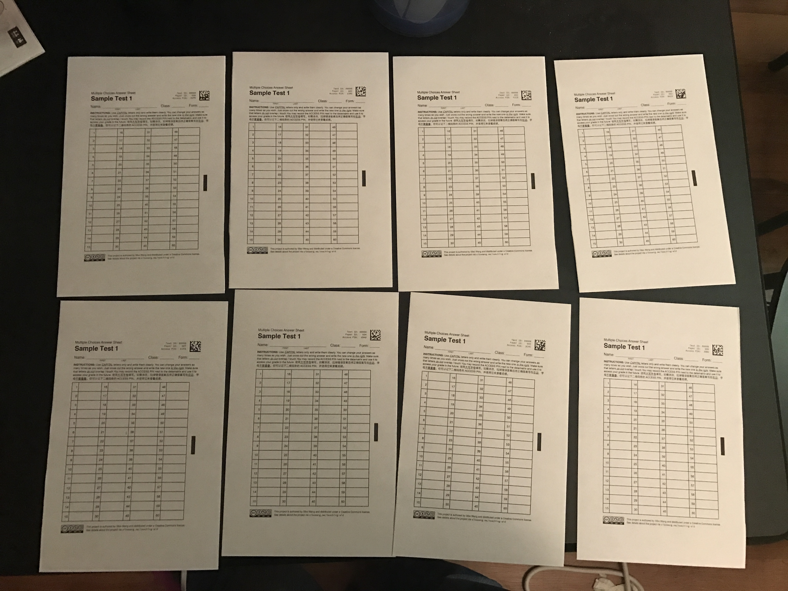
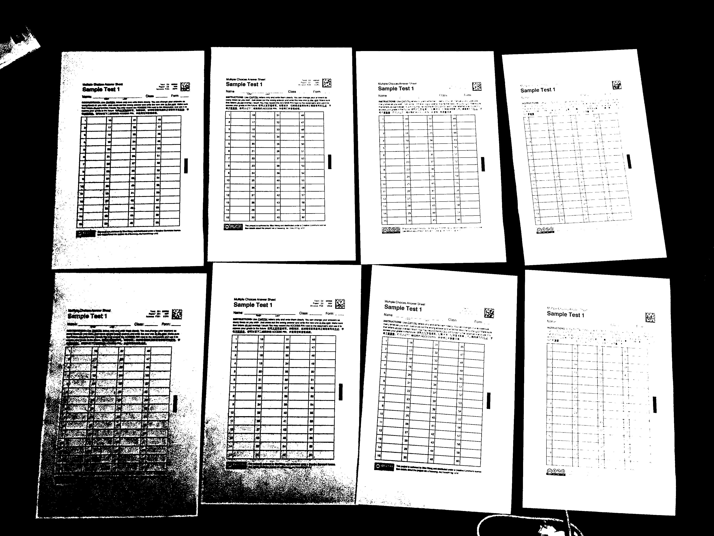
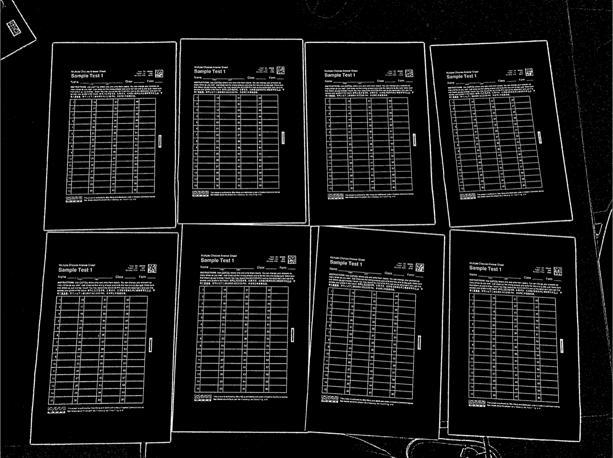
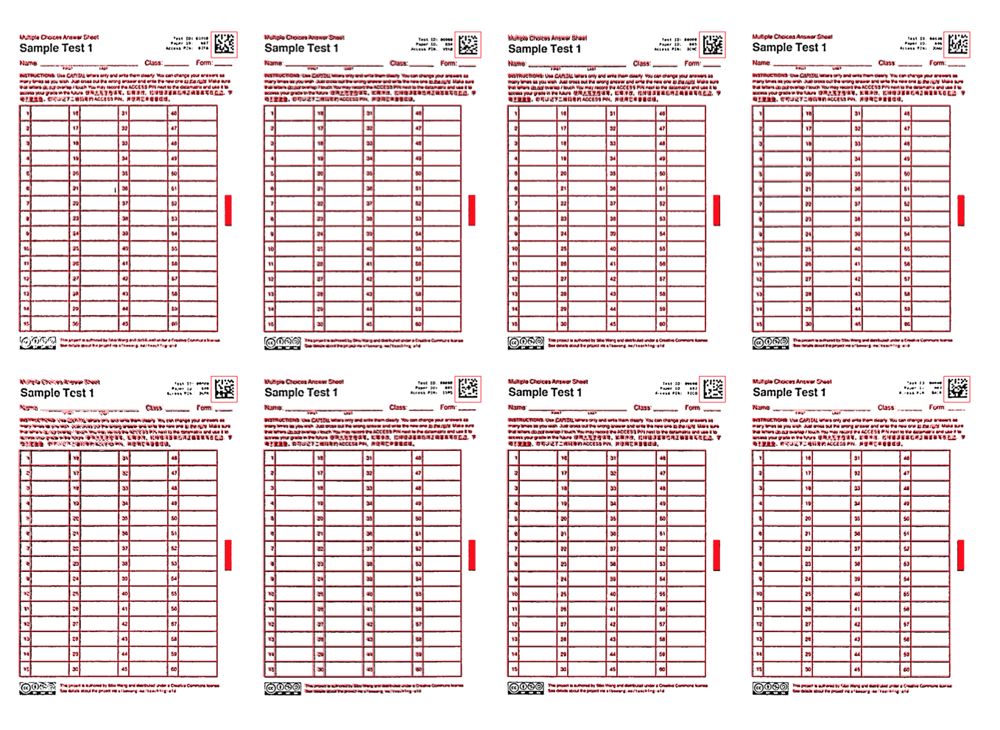
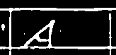

# 答题卡扫描器的介绍

## 基本期待效果
教师下载答题卡并打印，学生填写，教师用手机拍照，系统自动给出成绩。

## 复杂一点的期待效果
* 教师输入份数即可以PDF格式下载对应份数的答题卡，每张答题卡上有不同的二维码；
* 教师输入正确答案
* 随机分发给学生后，学生正常写上班级姓名和答案（不需要涂卡，在指定位置写字母即可）
* 教师回收答题卡，把答题卡摊开拍照（一次拍8张左右，这样一个班的卷子四次左右就能改完了），并上传系统
* 系统识别答题卡、套入模板、截取班级姓名和每一个问题的回答
* 识别每个答案，并与正确答案对照，保存到数据库
* 同时，在原始图片上加上分数和结果的标签，返回教师（方便直接把成绩写在答题卡上）
* 从数据库生成成绩单和正确率统计
* 学生可以通过答题卡上的Access PIN查看自己的批改情况以核对错误（见后面……其实我也不确定要不要这样搞）

## 需要的技能
* 一个叫做OpenCV的计算机视觉（CV, Computer Vision）library。Library 是用来满足一种特定功能的一坨module，带有一堆有用的function和class。
* 数据库可以理解为一个Excel文件，它里面有许多张表格，每个表格都有很多列和很多行，用来保存各种数据。有一种专门的语言叫做 Structured Query Language（SQL），用来和这个「Excel文件」进行交互（正常用Excel的时候你可以鼠标键盘操作，但是用SQL我们可以用简单的代码来存取数据）。我们数据库用MySQL搞就好，基本语句非常简单，见面给你讲。
* 如果做App的话需要iOS开发和安卓开发，这个应该是你的兴趣？我也没做过，可以一起学学。
* 有一些东西还是要在网页上搞的，比如initialize答题卡、下载PDF文件以供打印。这种东西我们可以随便拿PHP或者Django写个很丑但是能用的，看你对哪个感兴趣。PHP是一个相对比较古老的后台语言；Django是一个基于Python的网站开发环境其逻辑和手机app比较像（一个叫做MVC的结构）。域名、host可以挂在我的网站上。 

## 你能参与事情
* 我可能多偏CV这边一点，图像的初步处理算法我基本已经搞完了。
* Machine learning（手写识别）这方面我也还在学，其实我们可以一起搞，对以前的知识要求其实并不高，而且你不觉得机器学习很高端很通用很酷炫么！！！
* 剩下的东西，包括数据库、展示、app、网页什么的，貌似和你之前给我说的兴趣更接近，你可以主要来搞。
* 最后我还要搞一搞算法的优化（包括速度、空间、可靠性和robustness），你如果有兴趣的话我们也可以一起想想办法。

## 我到现在为止做成的事情
* 其实还没做成什么事情
* 设计了答题卡模板和答题卡生成器[代码](https://github.com/sibowsb/test_maker/blob/master/mcas_maker.py)，包括考试名称、二维码、ID
* 二相化图片（这部分以后的代码都在[这里](https://github.com/sibowsb/test_maker/blob/master/scanner.py)）
    - 为了把一张原始的图片转化成我们可以deal with的数据，首先我们一般会把它简化成黑白二相的（就像我给我们寝室做的T恤那种，不是黑就是白，没有灰）。
    - 如果用上次给你说的那种Photoshop上的简单threshold的话呢，我们很那把控那个threshold到底放在那里。如果threshold高了，有的文字也会被识别成背景；如果threshold低了，很多背景也会被当做是文字。每张图片的光照环境、背景都不一样，所以threshold很难把握。即使是在同一张图片里，因为我们一张图片有好几张答题卡，每张的光照环境又都不一样。因此如果用一个统一的threshold，即使我们针对每张图片都单独用某种方法计算出来一个最佳的threshold，还是会出现无法照顾到每张答题卡的问题，就像这样（注意左下和右上）：
    
    
    - 因此我用了一种叫做高斯自适应二相化（Adaptive Gaussian Thresholding）的方法。「自适应」的意思是我们把图片切成若干个小块，对每一个小块找出最合适的threshold，然后分别二相化。那么对于每一个小块我们是如何找出最合适的threshold的呢？我们是通过计算这个小块里的平均intensity（相当于亮度）作为我们的threshold。更具体地说，我们算的是加权平均数，权重以正态分布曲线给出所以叫做「高斯」，这并不重要。
    - 这样的话，我们就可以对几乎所有的图片都能得出如下的靠谱二相化结果。由于我们看的是在小范围内的相对亮度关系，所以凡是很均匀的东西，我们都把它当做了背景（无论是白色的纸张还是黑色的桌面）。
    
* 找出表格并确定方向
    - 接下来，我们需要找出表格在哪里。这部分我参考了一个自动解数独的程序，它里面也有一步是识别数独表格，方法是把所有封闭轮廓线近似成多边形，然后找出最大的n个凸面四边形。
    - 讲道理其实应该找出来整张答题卡的轮廓，但它找出来的其实是表格的轮廓。虽然我不知道为什么但这样其实挺好的，因为更方便定位了。看以后会不会出问题吧。
    - 在四个边旁边扫描中点位置的亮度，最暗的那个是右边（因为我在答题卡表格的右边加了一个定位用的黑点）。这样的话即使照片的方向是反/侧的也可以。
* 几何变形、截取表格
    - 这时候我们的表格应该是奇形怪状的四边形（因为透视问题），我们希望把每张表格都拉回成矩形。因此，我们通过把表格的四个角对应模板上这四个角应该在的位置，做一个几何变换，然后分别保存每张答题卡。
    - 把每张答题卡上套上红色的模板，重叠效果是这样的：
        
* 截取内容
    - 接下来我们只需要简单地从按模板固定位置从图片上截取内容就可以了。我们截取学生班级姓名和答案，为了保险做一点偏移多截一点：
    
        
    
    - 然后过滤掉边缘，只保留格子里面的内容：
    
        
    
    - 然后我们需要截出来单独的字母。如果有拉掉的话，我们用最右边的字母。这个我还没弄。
* 识别字母
    - 再接下来就需要一些machine learning的东西来做字母识别了，大概会用到一个叫KNN（k-Nearest Neighbors）的算法，我也还在学。

## 几个其实我也挺纠结的事情
* 软件方面如果你有兴趣好好了解一下我做的算法并且重新熟悉一下编程的话，可以在做APP的时候照着我的Python代码重新写一遍。但是这样的确挺烦人的。我觉得更好的选择视我把识别部分封装成一个API（相当于线上的一个功能），然后你做软件的时候直接从那里用，识别部分其实是在服务器上跑。这样的确会慢一点，但是无所谓。
* 正确率我估计会在95%-97%左右。如果不好的话还可以稍微做一点改动做一个涂卡版本，那样正确率就会非常非常高了，到时候看吧。
